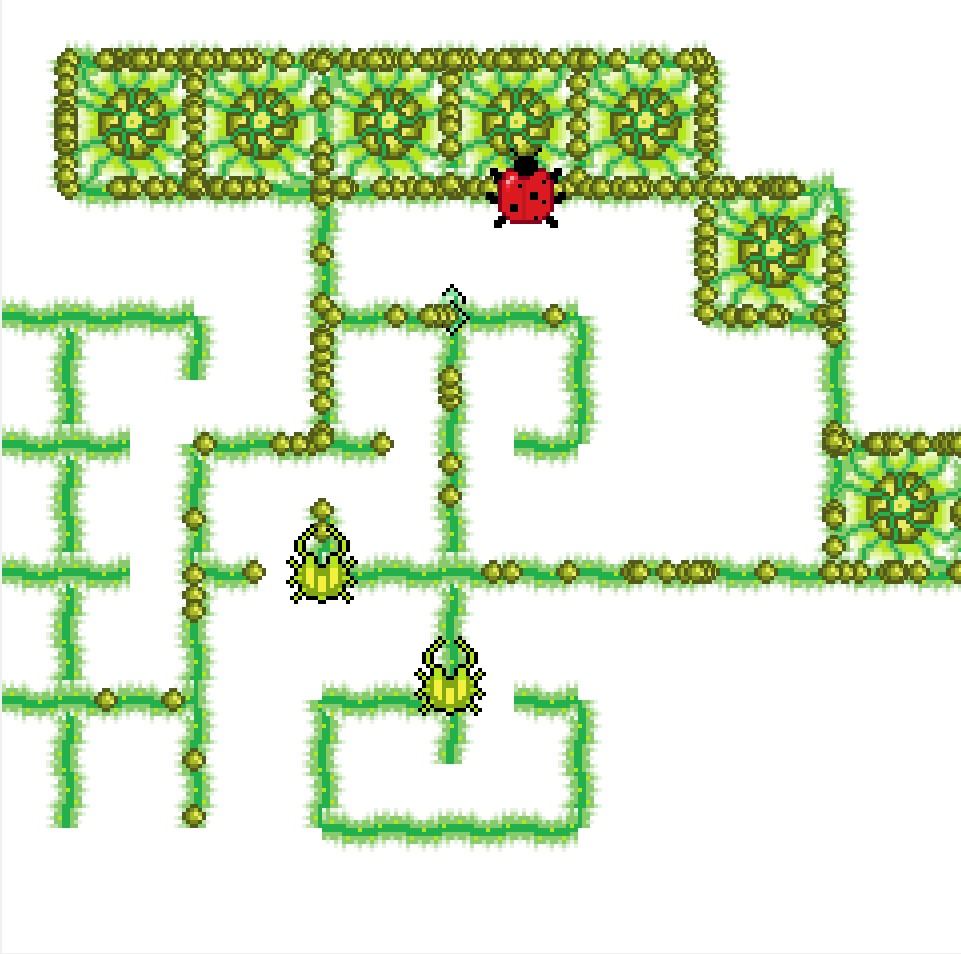

# VineGom
Grid-based vine traversal/creation game

Hobby project about creating vines.
The goal is to get rid of Aphids. You do this by creating Spores, which fuel Eggs.
Once an Egg is full of Spores, it creates a viscous Ladybug. The ladybug hunts down and destroys aphids.

Spores come from Pods, which created by drawing out a 1x1 square with your vines. Note that Pods like to be pretty isolated.

Move with WASD, arrow keys to link vines remotely.

Example gameplay screenshot:

